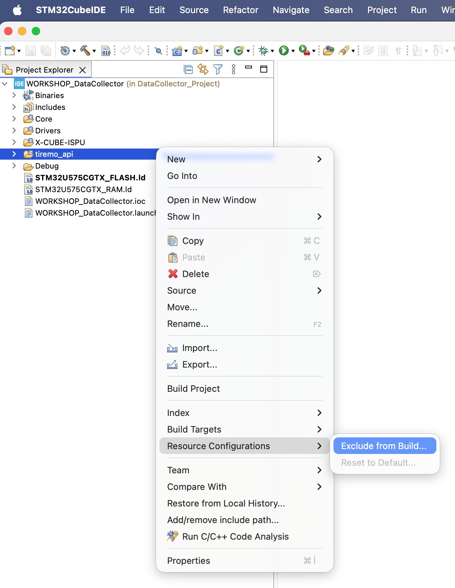
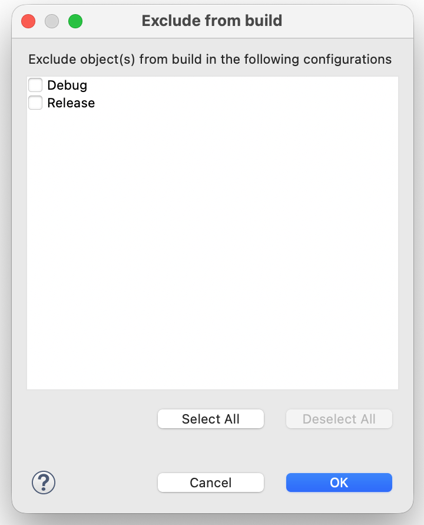
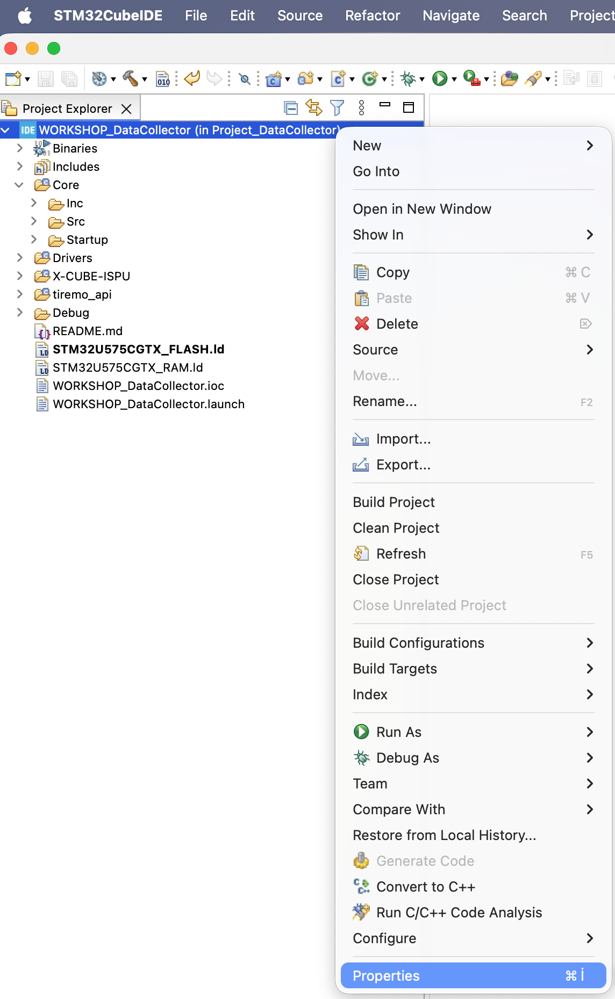
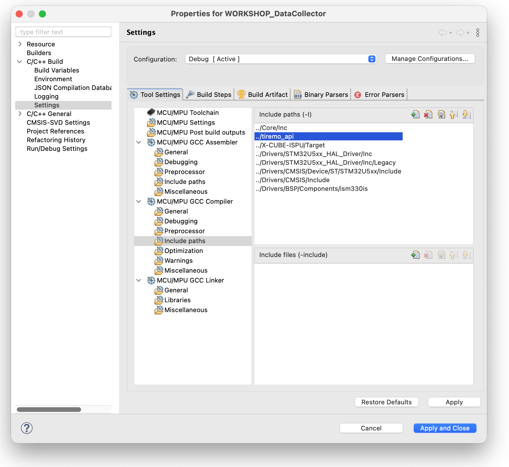

<p align="center">
    
</p>

## Edge-AI Entegrasyon Kılavuzu: DataCollector → EdgeAI

Bu kılavuz, **Project_DataCollector** projesine Tiremo®Intelligence tarafından üretilmiş bir AI modelini entegre ederek **Project_EdgeAI**'ya dönüştürme adımlarını açıklar. Üç temel değişiklik gereklidir: `tiremo_api` klasörünün eklenmesi, `main.c` dosyasının güncellenmesi ve STM32CubeIDE proje yollarının yapılandırılması.

---

## Ön Koşullar

- Activity-2 Not Defteri'nde model eğitimi ve dönüşümü tamamlanmış olmalıdır.
- Tiremo®Intelligence çıktısı olan `tiremo_api/` klasörü elde edilmiş olmalıdır.  
  Bu klasör aşağıdaki dört dosyayı içerir:

| Dosya | Açıklama |
|-------|----------|
| `tiremo_api.c` | `tiremo_ai_classify_label()` fonksiyonunun gerçekleştirimi |
| `tiremo_api.h` | API tanımları ve `TiremoStatus` dönüş kodları |
| `tiremo_classes.h` | Sınıf sayısı (`TIREMO_N_CLASSES`), enum ve etiket dizisi |
| `tiremo_config.h` | Backend seçimi (`TIREMO_BACKEND`) ve özellik sayısı (`TIREMO_N_FEATURES`) |

---

## Adım 1 — `tiremo_api/` Klasörünü Projeye Ekleyin

1. Tiremo®Intelligence'dan aldığınız `tiremo_api/` klasörünü kopyalayın.
2. Klasörü `Project_DataCollector/` kök dizinine yapıştırın.

Sonuç dizin yapısı:

```
Project_DataCollector/
├── Core/
├── Drivers/
├── tiremo_api/          ← YENİ
│   ├── tiremo_api.c
│   ├── tiremo_api.h
│   ├── tiremo_classes.h
│   ├── tiremo_config.h
│   └── model.h          ← Eğitilmiş model dosyası (Google Colab çıktısı)
└── WORKSHOP_DataCollector.ioc
```

---

## Adım 2 — STM32CubeIDE Yol Yapılandırması

STM32CubeIDE'nin `tiremo_api/` dosyalarını bulabilmesi için klasörü kaynağa ve include yoluna eklemelisiniz:

### 2a. Kaynak Klasörü Ekleyin



### 2b. Include Yolu Ekleyin
1. Proje dosyasına sağ tıklayarak Properties penceresini açın.

2. `C/C++ Build -> Settings -> Tool Settings -> MCU/MPU GCC Compiler -> Include paths` yolunu izleyin.
3. + simgesine tıklayarak `../tiremo_api` yolunu ekleyin.

4. Apply and Close ile değişiklikleri kaydedin.

---

## Adım 3 — `main.c` — Include Ekleyin

`Core/Src/main.c` dosyasındaki `/* USER CODE BEGIN Includes */` bloğuna aşağıdaki satırı ekleyin:

```c
/* Private includes ----------------------------------------------------------*/
/* USER CODE BEGIN Includes */
#include <stdio.h>
#include "ism330is.h"
#include "custom_bus.h"
#include <string.h>
/* --------- AI INCLUDE STARTS HERE ---------  */
#include <tiremo_api.h>
/* --------- AI INCLUDE ENDS HERE ---------  */
/* USER CODE END Includes */
```

---

## Adım 4 — `main.c` — AI Değişkenlerini Tanımlayın

`/* USER CODE BEGIN PV */` bloğunda, IMU tampon tanımlarının hemen ardına aşağıdaki değişkenleri ekleyin:

```c
int32_t imu_sensor_array[768];
int32_t gyro_sensor_array[384];
int32_t acc_sensor_array[384];
/* --------- AI VARIABLES STARTS HERE ---------  */
double tiremo_input[TIREMO_N_FEATURES];
double tiremo_probabilities[TIREMO_N_CLASSES];
const char *tiremo_label_out = NULL;
const size_t tiremo_n_classes = TIREMO_N_CLASSES;
/* --------- AI VARIABLES ENDS HERE ---------  */
```

| Değişken | Tür | Açıklama |
|----------|-----|----------|
| `tiremo_input` | `double[]` | Modele beslenecek ham veri |
| `tiremo_probabilities` | `double[]` | Her sınıf için tahmin olasılıkları |
| `tiremo_label_out` | `const char *` | En büyük olasılığa sahip sınıfın etiketi |
| `tiremo_n_classes` | `size_t` | `tiremo_classes.h` içinden alınan sınıf sayısı |

---

## Adım 5 — `main.c` — Çıkarım Bloğunu Ekleyin

Ana döngü içindeki `ACCELEROMETER_AND_GYRO` case bloğuna, `fill_accelerator_and_gyro_buffer()` çağrısının ardından çıkarım kodunu ekleyin:

**Önce (DataCollector):**

```c
case ACCELEROMETER_AND_GYRO:
    while (1) {
        fill_accelerator_and_gyro_buffer();

        for (int i = 0; i < 768; i++) {
            printf("%ld", imu_sensor_array[i]);
            if (i != 767) printf(" ");
        }
        printf("\r\n");
    }
    break;
```

**Sonra (EdgeAI):**

```c
case ACCELEROMETER_AND_GYRO:
    while (1) {
        fill_accelerator_and_gyro_buffer();
        /* --------- AI INFERENCE STARTS HERE --------- */
        for (size_t idx = 0; idx < TIREMO_N_FEATURES; idx++) {
            tiremo_input[idx] = (double) imu_sensor_array[idx];
        }
        if (tiremo_ai_classify_label(tiremo_input, tiremo_n_classes,
                                     tiremo_probabilities, &tiremo_label_out) == TIREMO_OK) {
            printf("%s\r\n", tiremo_label_out);
        }
        else {
            printf("Classification error\r\n");
        }
        /* --------- AI INFERENCE ENDS HERE --------- */
    }
    break;
```

---

## Değişiklik Özeti

```
tiremo_api/ (yeni klasör)
  [+] tiremo_api.c / tiremo_api.h                         ← Adım 1
  [+] tiremo_classes.h / tiremo_config.h                  ← Adım 1

main.c
  [+] #include <tiremo_api.h>                              ← Adım 3
  [+] tiremo_input / tiremo_probabilities / tiremo_label_out  ← Adım 4
  [+] tiremo_ai_classify_label() çıkarım bloğu            ← Adım 5

CubeIDE Proje Ayarları
  [+] Source Location: tiremo_api/                        ← Adım 2a
  [+] Include Path: ${ProjDirLoc}/tiremo_api              ← Adım 2b
```

---

## Doğrulama

1. Projeyi hatasız derleyin.
2. Tiremo®Cortex üzerine yükleyin.
3. UART'ı 115200 baud ile açın.
4. Tiremo®Cortex'i elinize alıp bir hareket gerçekleştirin:
   - Seri porta `CIRCLE`, `HORIZONTAL`, `STANDBY`, `TRIANGLE` veya `VERTICAL` etiketlerinden biri basılmalıdır.

---

## Kaynaklar

- [emlearn: Machine Learning for Embedded Systems](https://emlearn.readthedocs.io/)
