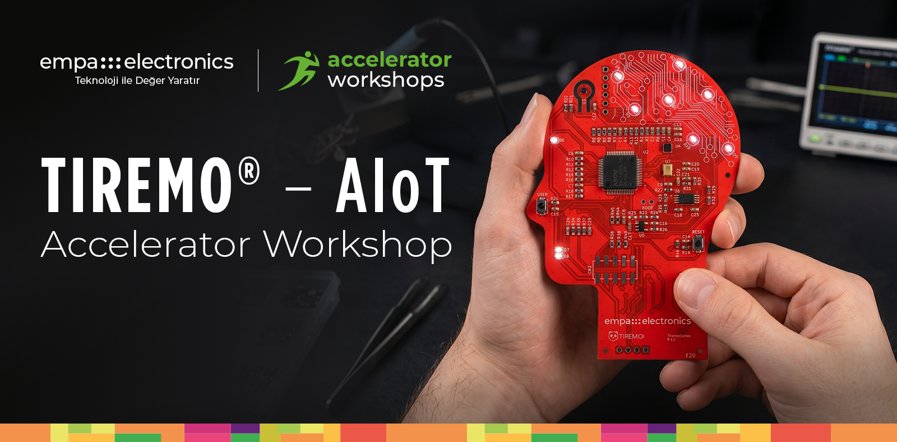
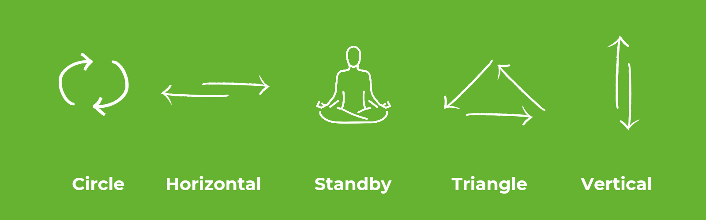

    

## Aktivite-2: Tiremo®Cortex İçin Edge-AI Çözümleri Geliştirme
Empa Electronics tarafından düzenlenen Tiremo® Accelerator Workshops etkinliğimize hoş geldiniz. Bu kılavuz, modern makine öğrenimi kütüphaneleri ve standart yaklaşımlarla geliştirilecek "El Hareketi Tanıma" (Hand Movement Recognition) demomuzun geliştirme adımlarında size rehberlik edecektir.

Aktivite içeriği olan "El Hareketi Tanıma" uygulaması, Empa Electronics tarafından tasarlanmış ve üretilmiş Tiremo®Cortex kullanılarak gerçekleştirilecektir. Kart üzerindeki ivmeölçerden alınan 3 eksenli sensör ölçümleri, bir yapay zeka modeline girdi olarak kullanılacak ve uç birim (Tiremo®Cortex) üzerinde 6 farklı el hareketini sınıflandırmak amacıyla kullanılacaktır. Tiremo®Cortex'in elde tutulmasıyla gerçekleştirilecek el hareketleri görsel ile açıklanmıştır.

## Aktivite
### ↳ [Tiremo®Cortex Platformunda Uçta Yapay Zeka Çözümleri: El Hareketi Tanıma (scikit-learn ile Random Forest)](https://colab.research.google.com/drive/1bbg1bfcpoIIn0kcI18elS_EtdG5Iee-f)
Aktivite içeriği olan "El Hareketi Tanıma" uygulamasının scikit-learn kütüphanesi ile oluşturulmuş Random Forest modelinin **Google Colab** üzerinde geliştirilmesini ve Tiremo®Intelligence'a entegre edilmiş emlearn aracı ile uç birime taşınmasını konu alan uygulama adımlarını içerir.

## Tiremo®Cortex Platformunda Uçta Yapay Zeka

**scikit-learn ile Makine Öğrenimi Modelleri Geliştirme**  
scikit-learn, Python tabanlı açık kaynaklı bir makine öğrenimi kütüphanesidir. Veri ön işlemeden model değerlendirmeye, hiperparametre optimizasyonundan farklı algoritmaların uygulanmasına kadar makine öğrenimi sürecinin neredeyse her adımı için hazır araçlar sunar. Sade yapısı ve geniş kullanım alanı sayesinde hem akademik hem de endüstriyel projelerde yaygın bir tercih olmuştur. Bu çalıştayda da geliştireceğimiz modellerin temelini oluşturacak kütüphane olarak kullanılacaktır.

**emlearn ile Uçta Yapay Zeka Modelleri Dağıtımı**  
emlearn, scikit-learn ile geliştirilmiş makine öğrenimi modellerini uç birimlerde çalıştırılabilir hale getiren bir model dönüşüm aracıdır. Kısıtlı kaynaklara sahip mikrodenetleyiciler göz önünde bulundurularak tasarlanmış olması sayesinde, eğitim aşamasında oluşturulan modellerin düşük bellek ve işlem gücüyle çalışacak biçimde optimize edilip uç birime taşınmasına imkân tanır.

**Tiremo®Intelligence ile Baştan Sona Uçta Yapay Zeka**  
Tiremo®Intelligence, makine öğrenimi modellerini eğitimden uç birime konuşlandırmaya kadar uçtan uca yöneten bir çözüm setidir. Popüler ML kütüphaneleriyle eğitilen modeller; dahili sıkıştırma ve derleme araçlarından geçerek emlearn, LiteRT Micro ve m2cgen gibi uç birim çalışma zamanlarına dönüştürülür ve Tiremo®Cortex gibi kaynak kısıtlı donanımlar üzerinde sensör tabanlı uygulamalarda koşturulur. Gömülü yazılım geliştiricileri ve AIoT uygulama ekiplerini hedefleyen bu iş akışı, modelden üretime geçişi tek bir çatı altında yönetir.

**Kurulum**  
Bu aktivite iki ayrı ortam gerektirir:

- **Model Geliştirme (Google Colab):** Makine öğrenimi modelinin eğitimi ve dönüştürülmesi, bulut tabanlı geliştirme ortamı olan Google Colab üzerinde gerçekleştirilecektir. "Aktivite" başlığı altındaki linke Google hesabınızla giriş yaparak erişebilirsiniz.

- **MCU'ya Yükleme (VS Code + AUDK32):** Eğitilen modelin Tiremo®Cortex üzerine yüklenmesi için MCU geliştirme ortamı gerekmektedir.
  ### ↳ [Geliştirme Ortamı Kurulumu — VS Code & ABOV A34G43x](../SETUP_VSCODE.md)
  VS Code, CMake, Ninja ve ARM GCC kurulumu ile `Activity1_Sensor_Connectivity_and_MQTT/Project_MQTT/AUDK32_A34xxxx-1.0.11/` projesini derleme adımlarını içerir.

**Kaynaklar & Okuma Önerileri**  
1. [scikit-learn: Machine Learning in Python](https://scikit-learn.org/)
2. [emlearn: Machine Learning for Embedded Systems](https://emlearn.readthedocs.io/)
3. [m2cgen: Convert Trained Machine Learning Models to Code](https://github.com/BayesWitnesses/m2cgen)
4. [LiteRT for Microcontrollers: A Runtime for TinyML Models](https://ai.google.dev/edge/litert/microcontrollers/)
5. [TensorFlow2 Quick Start for Beginners](https://www.tensorflow.org/tutorials/quickstart/beginner)